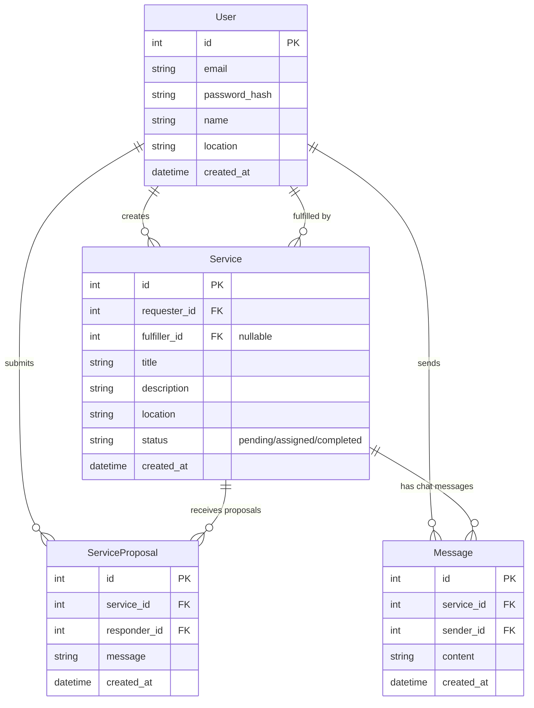

# AskIt

## Database Schema

## How It Works

1. **User** creates a **Service** (request)
2. Other users submit **ServiceProposals** (single initial response)
3. Requester selects a responder → `fulfiller_id` gets set
4. **Messages** table activates for back-and-forth chat between requester and fulfiller